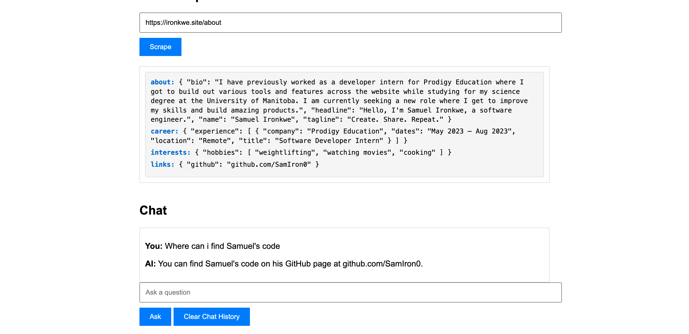

# Web Scraper and Chat Application

This project is a web application that combines web scraping capabilities with a chat interface powered by a large language model. It allows users to scrape content from websites and ask questions about the scraped information.

## Features

- Web scraping using Selenium
- Content cleaning and processing
- JSON extraction from scraped content
- Conversational AI using a large language model
- Vector store for efficient information retrieval
- User-friendly web interface
- Scrapy integration for advanced web scraping



## Technologies Used

- Python 3.x
- Flask
- Selenium
- BeautifulSoup
- Langchain
- FAISS
- Sentence Transformers
- DeepInfra API (Meta-Llama-3.1-70B-Instruct model)

## Setup

1. Clone the repository:
   ```
   git clone https://github.com/yourusername/web-scraper-chat-app.git
   cd web-scraper-chat-app
   ```

2. Create a virtual environment and activate it:
   ```
   python -m venv myenv
   source myenv/bin/activate  # On Windows, use `myenv\Scripts\activate`
   ```

3. Install the required dependencies:
   ```
   pip install -r requirements.txt
   ```

4. Set up environment variables:
   Create a `.env` file in the root directory and add the following:
   ```
   DEEPINFRA_API_TOKEN=your_deepinfra_api_token
   ```

5. Run the application:
   ```
   python wsgi.py
   ```

6. Open your web browser and navigate to `http://localhost:5000` to use the application.

## Usage

1. Enter a URL in the input field and click "Scrape" to fetch and process the content.
2. The scraped content will be displayed in a structured JSON format.
3. Use the chat interface to ask questions about the scraped content.
4. The AI will provide answers based on the context of the scraped information.

## Testing

To run the tests, use the following command:

```
pytest
```
